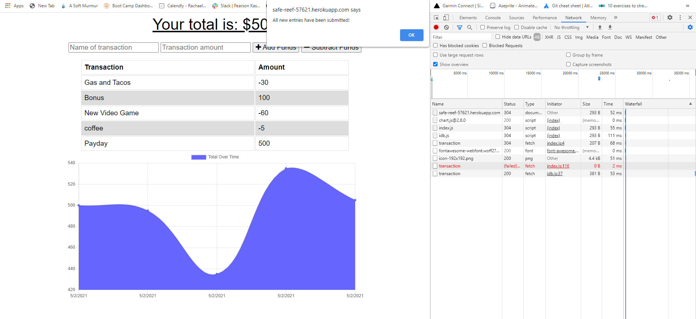

# Budget Tracker

## Description
A progressive web application the allows for use offline that will update the NoSQL database via MongoDB once the application regains online connectivity.

## Built With
* Node
* Express
* JavaScript
* MongoDB
* Mongoose
* IndexedDB

## Application
https://safe-reef-57621.herokuapp.com/

## Preview

## Questions
If you have any further questions about this application / repository feel free to contact me at: 
* [GitHub](https://github.com/jpkashlak)
* E-Mail: jpkashlak@gmail.com
